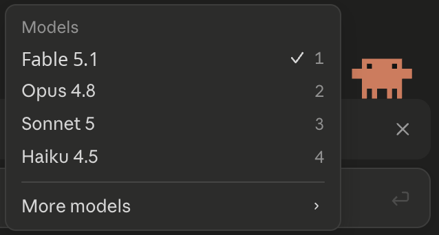

# Claude Desktop Fable 5.1 Patch for macOS

A local patch for Claude Desktop on Apple Silicon that surfaces Fable 5.1 in the model picker. The repository includes a guided installer, an uninstaller, and the payload files needed to apply the patch on a local macOS install.

<p align="center">
  
</p>

<p align="center">
  <a href="#compatibility">Compatibility</a> ·
  <a href="#installation">Installation</a> ·
  <a href="#what-it-changes">What It Changes</a> ·
  <a href="#troubleshooting">Troubleshooting</a> ·
  <a href="#uninstall">Uninstall</a>
</p>

---

## What This Is

This repository patches a local Claude Desktop installation on macOS. It is designed for Apple Silicon Macs and keeps the install and uninstall flow simple:

- one terminal command or a double-click installer
- clear progress output during setup
- an uninstall script for cleanup
- reapplication after Claude Desktop updates

This project is not affiliated with Anthropic.

## Compatibility

| Requirement | Value |
| --- | --- |
| macOS | 13.0 Ventura or later |
| CPU | Apple Silicon (arm64) |
| App path | `/Applications/Claude.app` |
| Claude Desktop | 1.18200 or later |
| Account | Active Claude.ai / Anthropic login |
| Disk space | About 50 MB free |

Quit Claude Desktop completely before installing.

## Installation

### Terminal

```bash
git clone <repo-url>
cd claude-desktop-fable-51-macos
chmod +x install.sh uninstall.sh
./install.sh
```

### Finder

1. Clone or download this repository.
2. Open the folder in Finder.
3. Double-click `install.command`.

If macOS blocks the file, right-click `install.command`, choose Open, then Open again.

To remove the patch later, double-click `uninstall.command` or run `./uninstall.sh`.

## What It Changes

The installer applies a layered local patch to the Claude Desktop bundle:

- model catalog and selector entries
- supporting model registry files under `payload/ion-dist/model-registry/`
- bundle metadata and integrity files
- helper binaries and entitlements used by the patch
- local patch markers in Application Support

Installation usually takes about 1.5 to 2 minutes. A brief Keychain prompt may appear during setup. If it does, allow it and the installer will continue.

## After Installation

1. Open Claude Desktop.
2. Go to Settings > Model.
3. Select Fable 5.1.
4. Start a new chat.

If Claude Desktop updates itself later, rerun `./install.sh`.

## Project Layout

```text
.
├── install.sh
├── install.command
├── uninstall.sh
├── uninstall.command
├── assets/
├── patch/
└── payload/
```

## Troubleshooting

- Claude Desktop is already running: quit it fully with Cmd+Q, then rerun the installer.
- Fable 5.1 is missing: restart Claude Desktop and rerun the installer after any update.
- Claude Desktop is not found: install it from the official download page and keep it in `/Applications/Claude.app`.
- The installer finishes but changes do not appear: confirm Claude Desktop was fully closed before install.

## Uninstall

```bash
./uninstall.sh
```

The uninstall script removes patch markers and related local preferences. To fully restore Claude Desktop, reinstall the official app from Anthropic.

## Disclaimer

This repository modifies a local Claude Desktop installation. Review the scripts before running them. Not affiliated with Anthropic.

## License

MIT. See [LICENSE](LICENSE).
